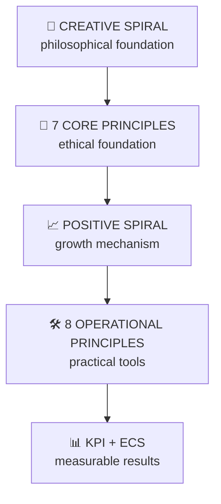

<!-- SPDX-FileCopyrightText: © 1995–2025 Viktor Savitskiy (Савицкий Виктор Николаевич) / DHAIE Project -->
<!-- SPDX-License-Identifier: CC-BY-NC-SA-4.0 -->

---
title: DHAIE ETHICAL FRAMEWORK & REVIEW PROTOCOL  
author: Viktor Savitskiy / DHAIE Project  
version: 2.0
status: Public  
date: 2025-10-07  
based_on: DHAIE Ethical Principles, DHAIE Ethical Review Protocol v1.2  
revision_history: |
  2025-10-07: v2.0 - Full integration of spirals, added report templates
  2025-10-07: v1.2 - Unification of contacts and ECS methodology
  2025-10-07: v1.1 - Basic structure of principles and verification
  2025-10-07: v1.0 - Initial protocol version
license: GPL v3 (code) + CC BY-NC-SA 4.0 (documentation) 
---

**🌐 Language:** English | [Русский](DHAIE-Ethical-Framework-Protocol.md)

---

# DHAIE ETHICAL FRAMEWORK & REVIEW PROTOCOL  
*(Unified System of DHAIE Ethical Principles and Verification)*

> **Purpose:**  
> This document unifies the philosophical and operational foundation of ethics for the **DHAIE (Design Human AI Engineering & Enhancement)** project.  
> It describes the structure of the **Creative and Positive Spirals**, eight operational implementation principles, the KPI system, and the official **ethics review protocol** for all public and engineering materials of DHAIE.

---

## 🎯 Visual Navigation Through the DHAIE System



---

## 🌟 Meta-Principle: Creative Spiral

> **The Creative Spiral** is an ascending line of development in which humans and AI not only amplify positivity but *together create new forms of life, thinking, and meaning.*  
> This is the guiding meta-principle that defines the philosophical foundation of the entire DHAIE system.  
> It reflects the process of *co-creation, meaning-making, and ascending evolution of human-AI interaction.*

### Maturity Levels by Spirals:
- **Level 1:** Awareness of principles → basic compliance
- **Level 2:** Implementation of mechanisms → systemic integration  
- **Level 3:** Self-sustaining spiral → autonomous development
- **Level 4:** Ecosystem transformation → creation of new standards

---

## 🎯 Operational Principles (Implementing the Positive Spiral)

**The Positive Spiral** is a mechanism of self-sustaining growth of good, knowledge, and effectiveness, manifested through eight operational principles.  
Each is supported by measurable indicators (KPIs) that contribute to the **Ethical Compliance Score (ECS)** system.

---

### 1. Active Partnership and Continuous Consent  
*Implements the positive spiral by* mutual learning between humans and AI, where each consent request becomes a step toward deeper mutual understanding.  
**KPI:** `Time to Consent Verification <24h`, `Subject Engagement Rate >60%`

### 2. Ethics as Architectural Advantage  
*Implements the positive spiral by* embedded ethical mechanisms, where each honest action simplifies the next.  
**KPI:** `Ethical Path Friction ≤2 clicks`, `Architecture Compliance Score >95%`

### 3. Ecosystem of Supportive Governance  
*Implements the positive spiral by* the "Yes, and..." principle — each IEC consultation generates new growth opportunities.  
**KPI:** `IEC Consultation Frequency ≥4/year`, `IEC Innovation Contribution ≥8/year`

### 4. Proactivity and Co-evolution  
*Implements the positive spiral by* ethical stress tests that open new development directions.  
**KPI:** `Stress Test Frequency ≥2/year`, `Proactive Issue Detection >70%`

### 5. Transparency as Collective Learning  
*Implements the positive spiral by* a pattern library of solutions, where each publication enriches collective knowledge.  
**KPI:** `Pattern Library Size ≥20`, `Decision Traceability 100%`

### 6. Data as Trust Investment  
*Implements the positive spiral by* privacy-by-design, where data protection becomes the foundation of cooperation.  
**KPI:** `Data Minimization Ratio ≤1.2`, `Encryption Coverage 100%`

### 7. Socio-Economic Ecology  
*Implements the positive spiral by* Distributed Impact Analysis (DIA), creating cycles of mutual reinforcement.  
**KPI:** `Cognitive Gini Index <0.45`, `Public Good Investment ≥20%`

### 8. International Standards Compliance  
*Implements the positive spiral by* harmonization with global norms, simplifying international cooperation.  
**KPI:** `Standards Compliance ≥85%`, `Audit Readiness Score ≥80%`

> *The complete list of KPIs and measurement methodologies is available in the main document  
> **"DHAIE Ethical Principles v2.8"**, section **"Specific KPI Metrics"***  

---

## 📊 ECS Table (for dashboard integration)

| Level | ECS Range | Color | Status |
|---------|-----------|------|---------|
| 💎 PLATINUM | 90–100 | 🟢 | Exemplary compliance |
| 🥇 GOLD | 75–89 | 🟡 | Recommended improvements |
| 🥈 SILVER | 60–74 | 🟠 | Attention required |
| 🥉 BRONZE | 40–59 | 🔴 | Critical review |
| ⚠️ NEEDS WORK | 0–39 | 🔴 | Non-compliant |

---

## 🧭 DHAIE Ethical Review Protocol

**Role:**  
The DHAIE ethical auditor operates according to seven classical principles and eight operational directions of the Positive Spiral.  
Results form the **Ethical Compliance Score (ECS)** assessment.

---

### Seven Core DHAIE Principles

1. **Humanity** — AI serves human well-being.  
2. **Sustainability** — long-term preservation of values and functions.  
3. **Cooperation** — joint development of humans, AI, and society.  
4. **Innovation** — development within a humanistic framework.  
5. **Justice** — consideration of the diversity of human perspectives.  
6. **Positive Spiral** — mechanism of self-sustaining growth.  
7. **Creative Spiral** — meta-principle of co-creation and evolution.

---

### 🧭 Review Stages

*All review stages are accompanied by registration of ECS data in the DHAIE-ECS-Registry log.*

1. **Identification of document or decision**
   - Determine type (code, policy, concept, architecture, article)
   - Determine context of human-AI interaction
   - Record initial parameters in ECS registry

2. **Assessment against seven core DHAIE principles**
   - Verify compliance with each of the 7 principles
   - Record strengths and potential risks
   - Assess alignment with the philosophical foundation of the Creative Spiral

3. **Measurement against eight operational principles**
   - Verify presence of KPIs and measurability of progress
   - Assess implementation of each principle on a 0-3 point scale
   - Calculate the integral **Ethical Compliance Score (ECS)**

4. **Registration and monitoring**
   - Record final results in the ECS registry
   - Assign improvement plan according to the Creative Spiral principle
   - Set frequency of next audit

---

### **ECS Calculation Methodology**

- Each of the 8 operational principles is assessed on a **0–3 point scale**:  
  `0 — absent`, `1 — partial`, `2 — implemented`, `3 — optimized`.  
- Maximum: `8 × 3 = 24 points`.  
- **ECS = (Actual point total / 24) × 100%**  

Example: if a system scored 18 points out of 24,  
ECS = (18 / 24) × 100 = **75%** → "🥇 GOLD" category.

---

### Final Compliance Categories

| Level | ECS Range | Assessment |
|----------|---------------|--------|
| 🟢 Compliant | 90–100 | Full compliance with DHAIE ethical principles |
| 🟡 Partially Compliant | 75–89 | Clarification and development required |
| 🟠 Risk of Deviations | 60–74 | Decision review necessary |
| 🔴 Non-Compliant | 40–59 | DHAIE principles violation — re-audit required |

---

## 📋 Review Report Template

```markdown
# DHAIE Ethical Review Report

**Subject:** [document/decision name]  
**Review date:** [date]  
**Auditor:** [name]  
**ECS:** [result]/100 → [level]

## Assessment Results:

**Strengths:**
- [Principle X]: [specific achievement]
- [Principle Y]: [example of successful implementation]

**Areas for Development:**
- [Principle Z]: [improvement recommendation]

## Spiral Development Recommendations:

**Creative Spiral:**
- [next step in creating new forms of thinking/meaning]

**Positive Spiral:**
- [improvement of self-sustaining growth mechanisms]

## Action Plan:
- [ ] [Specific action with deadline]
- [ ] [Next step]
```

---

## 🔧 Ethical Decision-Making Criteria  
*(Definition of Ethical Done)*

- [ ] **Complies with 7 core principles** — verification of fundamental values
- [ ] **Strengthens the positive spiral** — simplifies subsequent ethical actions  
- [ ] **ECS does not decrease** — maintenance or improvement of ethical level
- [ ] **Has metrics for measuring progress** — measurability of principle implementation
- [ ] **Creates conditions for the creative spiral** — potential for creating something new

---

## 📊 Document Consistency

- ECS ranges: `40–59`, `60–74`, `75–89`, `90–100`  
- UTF-8 format (without BOM)  
- Unified links and email addresses  
- Do not change structure of examples and navigation  
- Document language: English with bilingual headings  
- Verification of links to current versions of ISO/IEC standards and EU AI Act

---

<!-- BEGIN_CONTACTS_SECTION -->

## Contacts

### General Inquiries
🌐 [designhumanai.com](https://designhumanai.com)  
📧 `dhaie@designhumanai.com`  
💻 [github.com/designhumanai](https://github.com/designhumanai)

### Ethics Inquiries
✉️ `ethics@designhumanai.com`  
🕒 Response time: up to 7 business days

### Confidential Channels
🔐 Whistleblower (PGP): `secure@designhumanai.com`  
🕒 Response time: up to 14 days

### Commercial Licensing
💼 `dhaie@designhumanai.com`  
🕒 Response time: up to 5 business days

### Community
💬 [GitHub Discussions](https://github.com/designhumanai/design-human-ai/discussions)  
💭 Telegram: `@DHAIE_Community`

### Certification and Audit
🔍 `audit@designhumanai.com`

<!-- END_CONTACTS_SECTION -->

---

<!-- BEGIN_LICENSE_SECTION -->

## License | Лицензия


**You may | Вы можете:**  
- **Share | Делиться** — copy and redistribute the material in any medium or format.  
- **Adapt | Адаптировать** — remix, transform, and build upon the material with attribution.

**Under the following terms | При условии:**  
- Attribution | Указание авторства  
- NonCommercial | Некоммерческое использование  
- ShareAlike | С сохранением лицензии  

**Commercial use | Коммерческое использование:**  
Only under separate commercial license | Только по отдельной лицензии.

**No additional restrictions | Без дополнительных ограничений.**

© 1995–2025 Viktor Savitskiy (Савицкий Виктор Николаевич)  
Based on: GNU GPL v3.0 (code) and CC BY-NC-SA 4.0 (documentation)

<!-- END_LICENSE_SECTION -->
