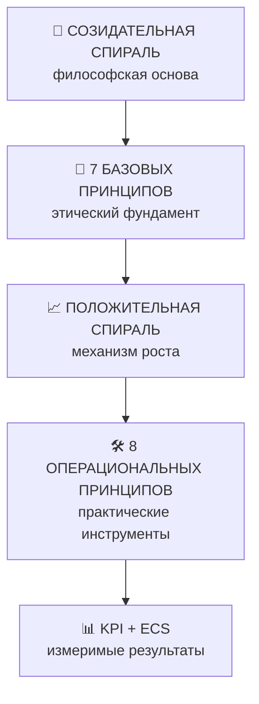

<!-- SPDX-FileCopyrightText: © 1995–2025 Viktor Savitskiy (Савицкий Виктор Николаевич) / DHAIE Project -->
<!-- SPDX-License-Identifier: CC-BY-NC-SA-4.0 -->

---
title: DHAIE ETHICAL FRAMEWORK & REVIEW PROTOCOL  
author: Viktor Savitskiy / DHAIE Project  
version: 2.0
status: Public  
date: 2025-10-07  
based_on: DHAIE Ethical Principles, DHAIE Ethical Review Protocol v1.2  
revision_history: |
  2025-10-07: v2.0 - Полная интеграция спиралей, добавлены шаблоны отчётов
  2025-10-07: v1.2 - Унификация контактов и методики ECS
  2025-10-07: v1.1 - Базовая структура принципов и проверки
  2025-10-07: v1.0 - Первоначальная версия протокола
license: GPL v3 (код) + CC BY-NC-SA 4.0 (документация) 
---

# DHAIE ETHICAL FRAMEWORK & REVIEW PROTOCOL  
*(Единая система этических принципов и проверки DHAIE)*

> **Назначение:**  
> Настоящий документ объединяет философскую и операциональную основу этики проекта **DHAIE (Design Human AI Engineering & Enhancement)**.  
> Он описывает структуру **Созидательной и Положительной спиралей**, восемь операциональных принципов реализации, систему KPI и официальный **протокол проверки этики** для всех публичных и инженерных материалов DHAIE.

---

## 🎯 Визуальная навигация по системе DHAIE



---

## 🌟 Мета-принцип: Созидательная спираль

> **Созидательная спираль** — это восходящая линия развития, в которой человек и ИИ не просто усиливают позитив, а *вместе создают новые формы жизни, мышления и смысла.*  
> Это направляющий мета-принцип, определяющий философскую основу всей системы DHAIE.  
> Он отражает процесс *сотворчества, смыслообразования и восходящей эволюции взаимодействия человека и искусственного интеллекта.*

### Уровни зрелости по спиралям:
- **Уровень 1:** Осознание принципов → базовое соответствие
- **Уровень 2:** Реализация механизмов → системная интеграция  
- **Уровень 3:** Самоподдерживающаяся спираль → автономное развитие
- **Уровень 4:** Трансформация экосистемы → создание новых стандартов

---

## 🎯 Операциональные принципы (реализующие Положительную спираль)

**Положительная спираль** — это механизм самоподдерживающегося роста добра, знаний и эффективности, проявляющийся через восемь операциональных принципов.  
Каждый из них подкрепляется измеримыми показателями (KPI), входящими в систему **Ethical Compliance Score (ECS)**.

---

### 1. Активное партнёрство и непрерывное согласие  
*Реализует положительную спираль через:* взаимное обучение человека и ИИ, где каждый запрос согласия становится шагом к более глубокому взаимопониманию.  
**KPI:** `Time to Consent Verification <24h`, `Subject Engagement Rate >60%`

### 2. Этика как архитектурное преимущество  
*Реализует положительную спираль через:* встроенные этические механизмы, где каждое честное действие упрощает следующее.  
**KPI:** `Ethical Path Friction ≤2 клика`, `Architecture Compliance Score >95%`

### 3. Экосистема поддерживающего управления  
*Реализует положительную спираль через:* принцип "Да, и..." — каждая консультация НЭК порождает новые возможности роста.  
**KPI:** `NEC Consultation Frequency ≥4/год`, `NEC Innovation Contribution ≥8/год`

### 4. Проактивность и коэволюция  
*Реализует положительную спираль через:* этические стресс-тесты, открывающие новые направления развития.  
**KPI:** `Stress Test Frequency ≥2/год`, `Proactive Issue Detection >70%`

### 5. Прозрачность как коллективное обучение  
*Реализует положительную спираль через:* библиотеку паттернов решений, где каждая публикация обогащает общее знание.  
**KPI:** `Pattern Library Size ≥20`, `Decision Traceability 100%`

### 6. Данные как инвестиция в доверие  
*Реализует положительную спираль через:* privacy-by-design, где защита данных становится основой сотрудничества.  
**KPI:** `Data Minimization Ratio ≤1.2`, `Encryption Coverage 100%`

### 7. Социально-экономическая экология  
*Реализует положительную спираль через:* анализ распределения ценности (DIA), создающий циклы взаимного усиления.  
**KPI:** `Cognitive Gini Index <0.45`, `Public Good Investment ≥20%`

### 8. Соответствие международным стандартам  
*Реализует положительную спираль через:* гармонизацию с глобальными нормами, упрощающую международное сотрудничество.  
**KPI:** `Standards Compliance ≥85%`, `Audit Readiness Score ≥80%`

> *Полный перечень KPI и методик измерения доступен в основном документе  
> **"DHAIE Ethical Principles v2.8"**, раздел **"Конкретные метрики KPI"***  

---

## 📊 ECS Table (для интеграции с dashboard)

| Уровень | ECS Range | Цвет | Статус |
|---------|-----------|------|---------|
| 💎 PLATINUM | 90–100 | 🟢 | Эталонное соответствие |
| 🥇 GOLD | 75–89 | 🟡 | Рекомендуемые улучшения |
| 🥈 SILVER | 60–74 | 🟠 | Требуется внимание |
| 🥉 BRONZE | 40–59 | 🔴 | Критический пересмотр |
| ⚠️ NEEDS WORK | 0–39 | 🔴 | Не соответствует |

---

## 🧭 Протокол этической проверки DHAIE

**Роль:**  
Этический аудитор DHAIE действует по семи классическим принципам и по восьми операциональным направлениям Положительной спирали.  
Результаты формируют оценку **Ethical Compliance Score (ECS)**.

---

### Семь базовых принципов DHAIE

1. **Человечность** — AI служит благополучию людей.  
2. **Устойчивость** — долгосрочная сохранность ценностей и функций.  
3. **Сотрудничество** — совместное развитие человека, ИИ и общества.  
4. **Инновация** — развитие в рамках гуманистической направленности.  
5. **Справедливость** — учёт разнообразия человеческих позиций.  
6. **Положительная спираль** — механизм самоподдерживающегося роста.  
7. **Созидательная спираль** — мета-принцип сотворчества и эволюции.

---

### 🧭 Этапы проверки

*Все этапы проверки сопровождаются регистрацией ECS-данных в журнале DHAIE-ECS-Registry.*

1. **Идентификация документа или решения**
   - Определить тип (код, политика, концепция, архитектура, статья)
   - Определить контекст взаимодействия человека и ИИ
   - Зафиксировать начальные параметры в ECS-реестре

2. **Оценка по семи базовым принципам DHAIE**
   - Проверить соблюдение каждого из 7 принципов
   - Зафиксировать сильные стороны и возможные риски
   - Оценить соответствие философской основе Созидательной спирали

3. **Измерение по восьми операциональным принципам**
   - Проверить наличие KPI и измеримость прогресса
   - Оценить реализацию каждого принципа по шкале 0-3 балла
   - Рассчитать интегральный **Ethical Compliance Score (ECS)**

4. **Регистрация и мониторинг**
   - Зафиксировать итоговые результаты в ECS-реестре
   - Назначить план улучшений по принципу Созидательной спирали
   - Установить периодичность следующего аудита

---

### **Методика расчета ECS**

- Каждый из 8 операциональных принципов оценивается по шкале **0–3 балла**:  
  `0 — отсутствует`, `1 — частично`, `2 — реализовано`, `3 — оптимизировано`.  
- Максимум: `8 × 3 = 24 балла`.  
- **ECS = (Фактическая сумма баллов / 24) × 100%**  

Пример: если система набрала 18 баллов из 24,  
ECS = (18 / 24) × 100 = **75%** → категория "🥇 GOLD".

---

### Итоговые категории соответствия

| Уровень | Интервал ECS | Оценка |
|----------|---------------|--------|
| 🟢 Соответствует | 90–100 | Полное соответствие этическим принципам DHAIE |
| 🟡 Частично соответствует | 75–89 | Требуется уточнение и развитие |
| 🟠 Риск отклонений | 60–74 | Необходим пересмотр решений |
| 🔴 Несоответствие | 40–59 | Нарушение принципов DHAIE — требуется реаудит |

---

## 📋 Шаблон отчёта о проверке

```markdown
# Отчёт этической проверки DHAIE

**Объект:** [название документа/решения]  
**Дата проверки:** [дата]  
**Аудитор:** [ФИО]  
**ECS:** [результат]/100 → [уровень]

## Результаты оценки:

**Сильные стороны:**
- [Принцип X]: [конкретное достижение]
- [Принцип Y]: [пример успешной реализации]

**Области для развития:**
- [Принцип Z]: [рекомендация по улучшению]

## Рекомендации по спиральному развитию:

**Созидательная спираль:**
- [следующий шаг по созданию новых форм мышления/смысла]

**Положительная спираль:**
- [улучшение самоподдерживающихся механизмов роста]

## План действий:
- [ ] [Конкретное действие с сроком]
- [ ] [Следующий шаг]
```

---

## 🔧 Этические критерии принятия решений  
*(Definition of Ethical Done)*

- [ ] **Соответствует 7 базовым принципам** — проверка фундаментальных ценностей
- [ ] **Укрепляет положительную спираль** — упрощает следующие этичные действия  
- [ ] **ECS не снижается** — сохранение или улучшение этического уровня
- [ ] **Есть метрики для измерения прогресса** — измеримость реализации принципов
- [ ] **Создаёт условия для созидательной спирали** — потенциал для создания нового

---

## 📊 Консистентность документа

- Диапазоны ECS: `40–59`, `60–74`, `75–89`, `90–100`  
- Формат UTF-8 (без BOM)  
- Ссылки и email-адреса унифицированы  
- Не изменять структуру примеров и навигации  
- Язык документа: русский с билингвальными заголовками  
- Проверка ссылок на актуальные версии стандартов ISO/IEC и EU AI Act

---

<!-- BEGIN_CONTACTS_SECTION -->

## Контакты

### Общие вопросы
🌐 [designhumanai.com](https://designhumanai.com)  
📧 `dhaie@designhumanai.com`  
💻 [github.com/designhumanai](https://github.com/designhumanai)

### Этические вопросы
✉️ `ethics@designhumanai.com`  
🕒 Ответ: до 7 рабочих дней

### Конфиденциальные каналы
🔐 Whistleblower (PGP): `secure@designhumanai.com`  
🕒 Ответ: до 14 дней

### Коммерческое лицензирование
💼 `dhaie@designhumanai.com`  
🕒 Ответ: до 5 рабочих дней

### Сообщество
💬 [GitHub Discussions](https://github.com/designhumanai/design-human-ai/discussions)  
💭 Telegram: `@DHAIE_Community`

### Сертификация и аудит
🔍 `audit@designhumanai.com`

<!-- END_CONTACTS_SECTION -->

---

<!-- BEGIN_LICENSE_SECTION -->

## Лицензия | License


**Вы можете | You may:**  
- **Делиться | Share** — копировать и распространять материал в любом формате.  
- **Адаптировать | Adapt** — перерабатывать и развивать материал с указанием авторства.

**При условии | Under the following terms:**  
- Attribution | Указание авторства  
- NonCommercial | Некоммерческое использование  
- ShareAlike | С сохранением лицензии  

**Коммерческое использование | Commercial use:**  
Только по отдельной лицензии | Only under separate commercial license.

**Без дополнительных ограничений | No additional restrictions.**

© 1995–2025 Viktor Savitskiy (Савицкий Виктор Николаевич)  
Основано на: GNU GPL v3.0 (код) и CC BY-NC-SA 4.0 (документация)

<!-- END_LICENSE_SECTION -->
